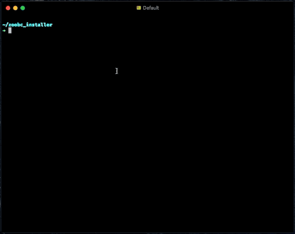

### ZOOBC INSTALLER SCRIPT

ZooBC installation script based on bashscript for help user to install ZooBC node in one easy way.

## Download Installer
1. You can clone this repo or just download the raw format.
   - via curl: `curl https://raw.githubusercontent.com/zoobc/zoobc-installer/master/installer.sh -o installer.sh` 
   - via wget: `wget https://raw.githubusercontent.com/zoobc/zoobc-installer/master/installer.sh`
2. Make sure the file permission `chmod +x installer.sh`
## Certificate File
1. Copy the certificate file `*.zbc` on the same directory with the `installer.sh` file.
   - Upload to server:
       - via scp: `scp {certificate_name}.zbc {user}@{ip_address}:{installation_path}`
> You can copy the `base64` string version of certificate and paste it on installation wizard when prompt certificate show.
## Run Installation
5. Run installation script: `./installer.sh {beta|alpha|staging|dev}` and follow the prompt.



## Running binary
6. To run the node:
   - **Install daemon**:
      - sudo ./zoobc daemon install --debug
   - **Start Daemon**:
      - `sudo ./zoobc daemon start`
   - **Stop Daemon**:
      - `sudo ./zoobc daemon stop`
    - **Status Daemon**:
      - `sudo ./zoobc daemon status`
    - Run binary file:
      - `cd $HOME/zoobc.{dev|staging|alpha|beta}`
      - `./zoobc run`
    - Stop binary file:
      - kill process `CTRL+c`

## Result
The script will create directory `zoobc.{target}` on the `$HOME`. There are several files:
```sh
~/zoobc
├── zoobc #binary
├── cmd #binary
├── config.toml
└── resource
    ├── node_keys.json
```

## Compatibility
- [x] MacOS
- [x] Linux
- [x] Windows 
